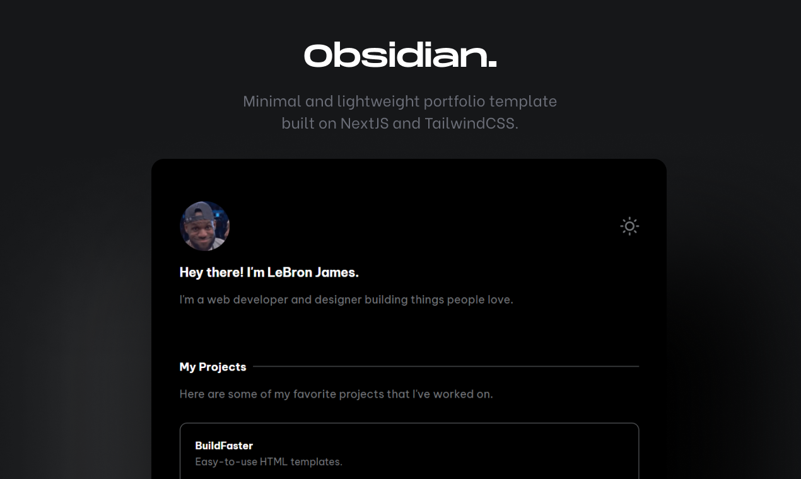

# Diego's Personal Profile Website



_✨ Welcome to my personal profile website! This site showcases my professional experience, skills, and projects. ✨_

* [About this project](#about-this-project)
* [Technologies used](#technologies-used)
* [Setup](#setup)
    * [Install the dependencies](#install-the-dependencies)
    * [Run locally](#run-locally)
* [Acknowledgments](#acknowledgments)

## About this project

This repository contains the source code for my personal profile website. It serves as a portfolio to highlight my professional journey, technical skills, and the projects I've worked on. The website is designed to be lightweight, responsive, and visually appealing.

## Technologies used

This project was built using the following technologies:

- **Next.js**: A React framework for server-side rendering and static site generation.
- **TailwindCSS**: A utility-first CSS framework for styling.
- **JavaScript**: The primary programming language for the project.
- **Vibe Coding**: A collaborative and creative coding approach.
- **VS Code Copilot**: AI-powered code completion and assistance.
- **GPT-4**: Used for generating ideas, refining content, and enhancing the development process.

## Setup

### Install the dependencies

Clone the repository and install the required dependencies:

```bash
# Clone the repository
git https://github.com/pandiello/fabada.git
cd fabada

# Install dependencies using NPM or Yarn
npm install
# or
yarn install
```

### Run locally

To see the website in action locally, run the development server:

```bash
# Start the development server
npm run dev
# or
yarn dev
```

Open your browser and navigate to `http://localhost:3000` to view the website.

## Acknowledgments

This project was developed with the help of:

- **Vibe Coding**: A collaborative and creative coding approach that inspired the design and functionality.
- **VS Code Copilot**: For providing AI-powered code suggestions and speeding up the development process.
- **GPT-4**: For assisting in content generation, refining ideas, and enhancing the overall quality of the project.

Thank you for visiting my profile website repository! Feel free to explore the code and reach out if you have any questions or feedback.
